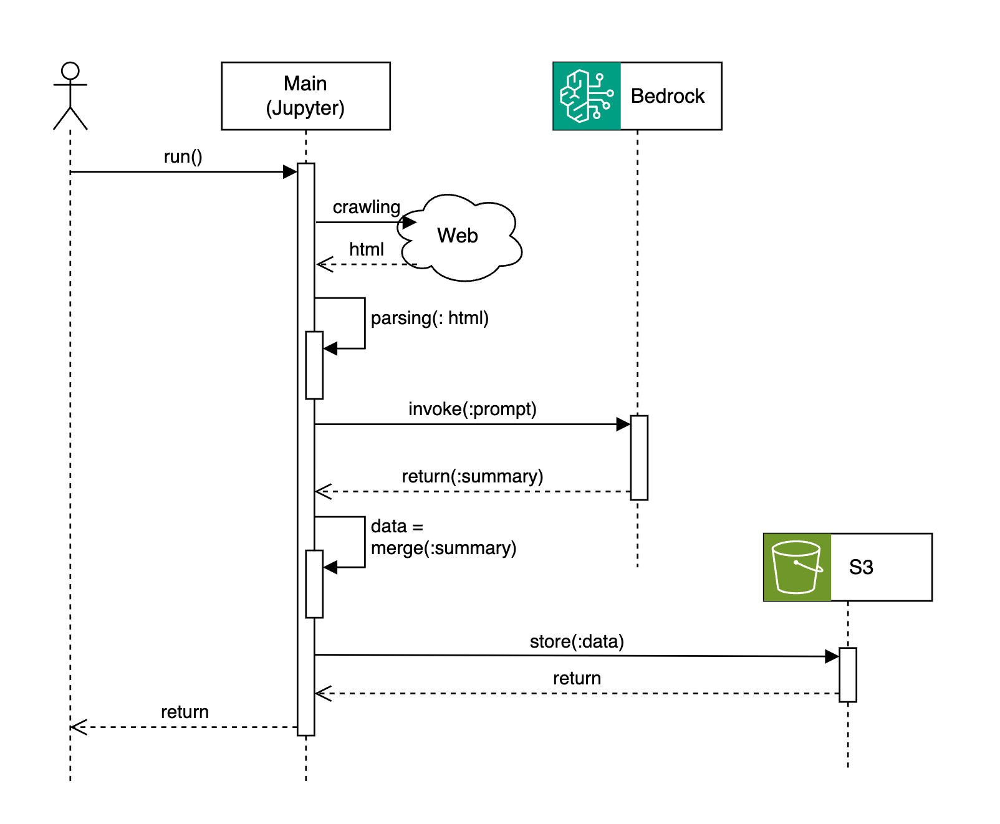

# 2024 AWS Enterprise Boost Program

## Amazon Bedrock & RAG sample codes
> <i> provided by Jesam Kim, Kichul Kim, Jisun Choi</i>


### Clone and use this notebooks
> Amazon SageMaker JupyterLab에서 File > New > Terminal을 클릭하여 "시스템 터미널"을 열어 다음과 같이 이 레포지토리를 복제(clone) 합니다.
<br>


```bash
cd ~/SageMaker
git clone https://github.com/jesamkim/2024-ebp.git

```

---

## <i>[01_bedrock_fundamental.ipynb](./01_bedrock_fundamental.ipynb)</i>
* 기본 1 : 기본적인 형태로 Bedrock의 Claude 3 모델 클라이언트를 생성하고 호출하는 방법을 확인 합니다.
* 기본 2 (중요) : LangChain을 활용하여 Bedrock의 Claude 3 모델을 호출하는 방법을 확인 합니다.


## <i>[02_OpenSearch_setup.ipynb](./02_OpenSearch_setup.ipynb)</i>
* RAG를 위한 OpenSearch Cluster를 생성 합니다.


## <i>[03_RAG_OpenSearch.ipynb](./03_RAG_OpenSearch.ipynb)</i>
* 앞서 생성한 OpenSearch를 활용해 RAG를 구성 합니다.
* 시맨틱 검색, 어휘 검색, 하이브리드 검색 기법을 확인 합니다.


## <i>[04_web_crawling.ipynb](./04_web_crawling.ipynb)</i>
* 이 샘플 코드는 google 검색에 대한 결과 페이지를 가져오는 예시 입니다.
* 샘플 코드 1 : beautifulsoup을 이용한 웹크롤링 샘플 코드 입니다.
* 샘플 코드 2 : selenium을 이용한 웹크롤링 샘플 코드 입니다.


## <i>[05_bedrock_and_docs.ipynb](./05_bedrock_and_docs.ipynb)</i>
* 이 샘플 코드는 크롤링 결과(csv 파일)를 요약하는 예시 입니다.


## <i>[06_read-docs-and-lsummarization.ipynb](./06_read-docs-and-lsummarization.ipynb)</i>
* 이 샘플 코드는 doc 파일을 읽는 것과, 문서 내용을 요약하는 예시 입니다.
* 샘플 코드 1 : doc 파일을 읽고 처리하는 예시
* 샘플 코드 2 : LangChain을 활용한 LLM invoke 예시
* 심플 코드 3 : 문서 전체 내용을 요약할때, 내용이 많은 경우 Map Reduce 방식을 활용하여 요약 하는 예시 (LangChain 활용)


## <i>[07_RAG_search_comp.ipynb](./07_RAG_search_comp.ipynb)</i>
* 이 샘플 코드는 두 개의 다른 OpenSearch 인덱스에서 쿼리한 내용을 비교하는 예시 입니다.
* Project-1 , Project-2 라는 두 개의 프로젝트를 각각에 필요한 문서로 RAG를 구성 합니다 (OpenSearch Index ; 도메인은 같음)
* 이 두 프로젝트에 대해서 공통 쿼리 (예 : 1차에너지 공급 연평균 성장률에 대해서 상세히 알려주세요.) 에 대한 답변을 얻습니다.
* 그 다음 두 답변에 대해 비교하는 쿼리 (예 : 다음 {context_1}과 {context_2}를 비교 합니다. 답변은 최대한 상세히 합니다. 모르는 내용을 말하지 않습니다.) 로 최종 비교 합니다.


---
## Sequence Diagram
### 과제 1 


### 과제 2


---

## 템플릿
* 아래 ToDo_1, ToDo_2 노트북은 각각 웹크롤링 후 S3 업로드, RAG 구현 단계를 만드는 템플릿 노트북 입니다.
* 이 곳에 팔요한 코드를 채워서 템플릿의 Flow를 따라서 완성하는 것을 권장 드립니다.

### <i>[ToDo_1_Crawling-Summary-Tableau.ipynb](./ToDo_1_Crawling-Summary-Tableau.ipynb)</i>


### <i>[ToDo_2_RAG-QnA.ipynb](./ToDo_2_RAG-QnA.ipynb)</i>


<br><br>

[참조] 본 노트북의 소스 코드들은 [aws-ai-ml-workshop-kr](https://github.com/aws-samples/aws-ai-ml-workshop-kr)의 컨텐츠를 참조하였습니다.


